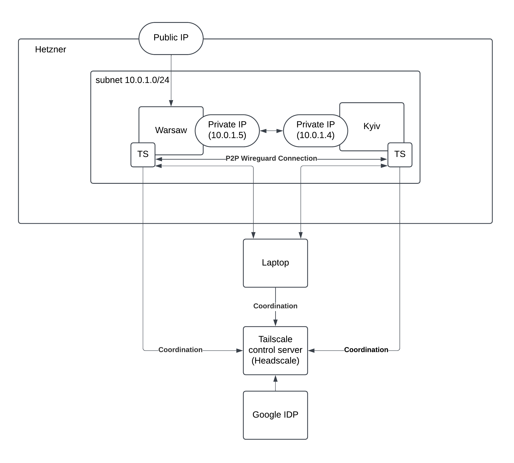

# Description:
This repository contains the demo plan and scripts for the Tailscale demo session. 
The demo is designed to showcase the advanced networking features of Tailscale:
- ssh access
- subnet routing
- exit nodes
- service exposure with Serve and Funnel
- security features like SSH session recording and access control policies.

Demo servers will be deployed in Hetzner cloud provider using smallest instances. Current price for 2 demo servers CX22 (2vCPU/4G RAM) ~$0.015/hour (no VAT).

# Prerequisites:
- 2 new Gmail test accounts (my test accounts warsawt100@gmail.com and kyivt101@gmail.com, ACL will be configured for them)
- [Hetzner cloud account and token](https://docs.hetzner.com/cloud/api/getting-started/generating-api-token/)
- Hetzner SSH key added via control panel
- [Terraform installed](https://developer.hashicorp.com/terraform/install?product_intent=terraform)
- Created terraform.tfvars file from terraform.tfvars.example with required variables
- Tailscale account registered using one of gmail accounts (free personal plan)
- Some Docker knowledge

# Demo Plan

### 1. Setup infrastructure in Hetzner cloud using terraform script
  - `terraform init`
  - `terraform apply`, you should get public IPs of Warsaw and Kyiv servers as an output
  
Output setup will be the following: 
  
### 2. Install Tailscale on cloud servers (Warsaw and Kyiv) and connect to Tailscale
- `ssh root@<warsaw_public_ip>`
- `curl -fsSL https://tailscale.com/install.sh | sh `
- `tailscale up`
- `tailscale login`, copy generated link and paste it in the browser to authenticate
- or using predefined authkey and script (Add server button in Tailscale control panel)

### 3. Send invite to another user (kyivt101@gmail.com) and connect client laptop to tailscale
 - install tailsclae on laptop
 - test DNS configuration when connected to tailscale

### 4. Configure ssh connection via Tailscale (enable ssh, add tag, check acl)
- connect to kyiv (using password), `tailscale up --ssh`
- use 01_taiscale_acl_ssh.json ACL file in control panel
- connect to Kyiv using VSCode extension via ssh over Tailscale
  
Output setup will be the following:

### 5. Configure subnet router on Warsaw server
- enable IP forwarding on Warsaw server (https://tailscale.com/kb/1019/subnets)
- advertise subnet `tailscale up --advertise-routes=10.0.1.0/24`
- confirm subnet routing in control panel
- test connection from laptop to 10.0.1.5 (Kyiv server)

### 6. Showcase exit node feature
- https://tailscale.com/kb/1103/exit-nodes
- setup exit node on Warsaw, confirm in control panel `tailcale up --advertise-exit-node` --advertise-routes=10.0.1.0/24``
- test connection from laptop to internet

### 7. Serve feature
- Install Docker on warsaw server (https://docs.docker.com/engine/install/debian)
- `docker run -d -p 8080:80 nginxdemos/hello`
- Open http://warsaw:8080
- `tailscale serve 8080`

### 8. Funnel feature
- Copy ./nginx-demo to warsaw server ``scp -r ./nginx-demo root@<warsaw_public_ip>:/root/``
- Get tailscale token from control panel (Add server)
- Update acl using 02_tailscale_acl_funnel.json
- start docker compose service `docker compose pull && docker compose up`
  
### 9. SSH session recording
- Copy ./ssh-recorder to warsaw server `scp -r ./ssh-recorder root@<warsaw_public_ip>:/root/`
- update acl using 03_tailscale_acl_ssh_recording.json
- start service `docker compose pull && docker compose up`
- connect to Kyiv using ssh
- check recording in the control panel using the tailscale admin account

# Cleanup
- `terraform destroy`

